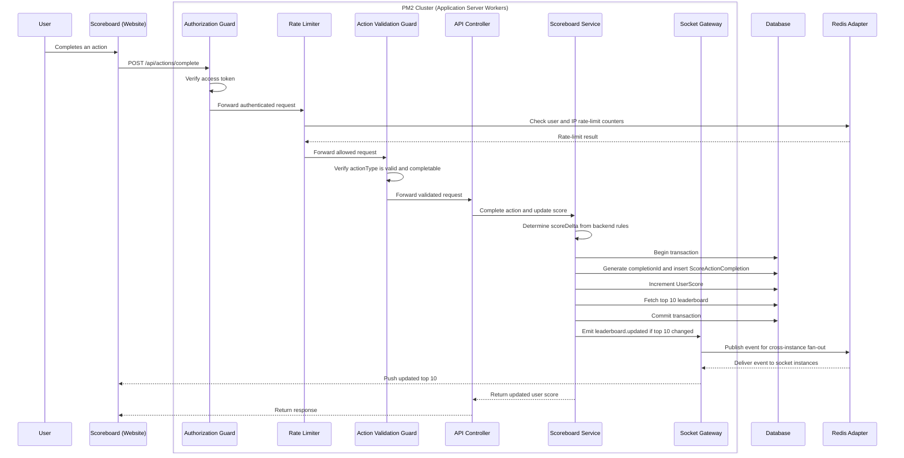

# Scoreboard API Module Specification

## Overview

This backend module manages action completion, score updates, and live leaderboard changes. It exposes APIs for reading the top 10 scores and completing authorized user actions that increase score.

## Tasks

- Allow authorized score increases after a user completes an action.
- Keep a persistent score record per user.
- Return and broadcast the top 10 scores.
- Prevent external callers from directly increasing arbitrary scores.
- Provide a clear implementation contract for the backend engineering team.

## Main Components

- `PM2 Cluster`: runs multiple application server workers on the same server and port.
- `Authorization Guard`: verifies the caller is authenticated before the request reaches the controller.
- `Action Validation Guard`: verifies the completed action is legitimate before the score update runs.
- `API Controller`: receives validated HTTP requests and delegates work to the service layer.
- `Scoreboard Service`: completes score-awarding actions, persists action completion records, updates user scores, and fetches the top 10 leaderboard.
- `Socket Gateway`: broadcasts leaderboard changes to connected subscribers.
- `Database`: persists user scores and score action completion records.
- `Redis Adapter`: synchronizes socket events across PM2 workers or multiple application server instances.

## Data Model

### UserScore

| Field | Type | Required | Notes |
| --- | --- | --- | --- |
| `user_id` | string | Yes | Unique user identifier. |
| `score` | number | Yes | Current total score. |
| `created_at` | datetime | Yes | Creation timestamp. |
| `updated_at` | datetime | Yes | Last score update timestamp. |

Recommended indexes:

- Unique index on `user_id`
- Descending index on `score`
- Compound index on `score DESC, updated_at ASC` for stable leaderboard ordering

### ScoreActionCompletion

| Field | Type | Required | Notes |
| --- | --- | --- | --- |
| `id` | string | Yes | Unique completion record id. |
| `user_id` | string | Yes | User receiving the score increase. |
| `action_type` | string | Yes | Backend-recognized action type, such as `complete-quiz`. |
| `score_delta` | number | Yes | Score amount awarded. |
| `created_at` | datetime | Yes | Completion record creation timestamp. |

Recommended indexes:

- Unique compound index on `user_id, action_type`
- Index on `created_at`

The purpose of `ScoreActionCompletion` table is to prevent replay attacks where the same action completion is submitted repeatedly. The backend creates this record internally after it validates the requested action type.

## API Contract

### Get Leaderboard

```http
GET /api/scoreboard
```

Returns the current top 10 users.

Response:

```json
{
  "data": [
    {
      "rank": 1,
      "userId": "user_123",
      "score": 2400,
      "updatedAt": "2026-06-07T10:00:00.000Z"
    }
  ]
}
```

### Complete Action

```http
POST /api/actions/complete
Authorization: Bearer <access_token>
Content-Type: application/json
```

Request:

```json
{
  "actionType": "complete-quiz"
}
```

Response:

```json
{
  "completionId": "completion_abc123",
  "actionType": "complete-quiz",
  "completed": true,
  "userId": "user_123",
  "score": 2450,
  "scoreDelta": 50,
  "leaderboardChanged": true
}
```

Rules:

- The authenticated user is always derived from the access token, never from request body.
- `actionType` must be recognized by backend rules.
- The backend creates `completionId` internally after validation.
- The backend must verify that the authenticated user is allowed to complete `actionType`.
- Score updates and action completion record creation must happen in one transaction.
- If the leaderboard changes, publish the new top 10 list to realtime subscribers.

## Authorization and Anti-Abuse Requirements

The backend must not trust an external request that only says "increase my score." The request must prove that an action was completed.

Required controls:

- Authenticate every action completion request with a valid access token.
- Derive `user_id` from the authenticated token.
- Verify `actionType` against backend-owned action rules.
- Reject invalid or already-completed actions.
- Enforce idempotency with a unique completion rule, such as `user_id + action_type` for one-time actions.
- Rate-limit action completion requests per user and per IP.

Validation rules:

- `actionType` must be valid and completable by the authenticated user.
- `actionType` must not have already been completed by the authenticated user when the action is one-time.
- `scoreDelta` must be determined by trusted server rules, not by an external caller-controlled value.

### Rate Limit Example

Use Redis-backed rate limiting so limits are shared across PM2 workers or multiple application server instances.

Core logic:

```typescript
const WINDOW_SECONDS = 60;
const MAX_REQUESTS_PER_WINDOW = 20;

const checkRateLimit = async (key: string): Promise<void> => {
  const count = await redis.incr(key);

  if (count === 1) {
    await redis.expire(key, WINDOW_SECONDS);
  }

  if (count > MAX_REQUESTS_PER_WINDOW) {
    throw new Error('Too many requests');
  }
};

await Promise.all([
  checkRateLimit(`rate-limit:action-complete:user:${userId}`),
  checkRateLimit(`rate-limit:action-complete:ip:${ip}`),
]);
```

Recommended behavior:

- Apply this middleware after authentication so `userId` is available.
- Use separate limits for user and IP to reduce credential abuse and anonymous traffic spikes.
- For production, consider a sliding-window or token-bucket algorithm for smoother traffic control.
- Log rate-limit rejections with `userId`, IP, and `actionType`.

## Realtime Updates

Use WebSocket for live scoreboard updates. For a Node.js implementation, Socket.IO with the Redis adapter is recommended when the application needs horizontal scaling.

Recommended endpoint:

```http
GET /api/scoreboard/live
```

Event payload:

```json
{
  "type": "leaderboard.updated",
  "data": [
    {
      "rank": 1,
      "userId": "user_123",
      "score": 2450,
      "updatedAt": "2026-06-07T10:01:00.000Z"
    }
  ]
}
```

Broadcasting rule:

- Only broadcast when the top 10 leaderboard changes.
- Broadcast the full top 10 list instead of partial updates to keep subscribers simple and consistent.
- In a single-server deployment, the Socket Gateway can emit directly to connected subscribers.
- In a multi-instance deployment, the Socket Gateway must use Redis adapter/pub-sub so every server instance receives the same `leaderboard.updated` event.

### Redis Adapter Scaling

When multiple application server instances are running, each instance only knows about the socket subscribers connected to itself. Redis adapter solves this by propagating socket events across all instances.

Recommended flow:

1. Scoreboard Service updates the score and commits the database transaction.
2. Scoreboard Service asks the local Socket Gateway to emit `leaderboard.updated`.
3. Socket Gateway publishes the event through Redis adapter.
4. Redis fan-outs the event to every Socket Gateway instance.
5. Each Socket Gateway pushes the updated top 10 list to its connected subscribers.

Recommended implementation:

```typescript
import { createAdapter } from '@socket.io/redis-adapter';
import { createClient } from 'redis';
import { Server } from 'socket.io';

const io = new Server(httpServer, {
  cors: {
    origin: process.env.WEBSITE_ORIGIN,
  },
});

const pubClient = createClient({ url: process.env.REDIS_URL });
const subClient = pubClient.duplicate();

await Promise.all([pubClient.connect(), subClient.connect()]);

io.adapter(createAdapter(pubClient, subClient));

io.emit('leaderboard.updated', {
  type: 'leaderboard.updated',
  data: topScores,
});
```

Deployment notes:

- API and Socket Gateway may run in the same application server process for the initial implementation.
- The application server can be horizontally scaled behind a load balancer.
- Redis must be shared by all application server instances.
- Socket authentication must still validate the user's access token during connection.
- Use graceful shutdown so an instance stops accepting new sockets before it is terminated.

### PM2 Single-Server Scaling

For a single-server deployment, use PM2 cluster mode to run multiple Node.js workers on the same port.

Example `ecosystem.config.js`:

```javascript
module.exports = {
  apps: [
    {
      name: 'scoreboard-api',
      script: 'dist/index.js',
      instances: 3,
      exec_mode: 'cluster',
      env: {
        NODE_ENV: 'production',
        PORT: 3000,
        REDIS_URL: 'redis://localhost:6379',
        ALLOWED_ORIGIN: 'https://your-consumer-app.com',
      },
    },
  ],
};
```

Run with:

```bash
pm2 start ecosystem.config.js
```

PM2 notes:

- PM2 creates multiple worker processes for the same application, workers share the same `PORT` in cluster mode.
- PM2 handles process restarts, log collection, and graceful reloads.
- Redis adapter is required so Socket.IO events are propagated between PM2 workers.
- PM2 is used for single-server process scaling, not full cloud auto-scaling.

## Execution Flow



## Error Handling

| Scenario | Status | Response Message |
| --- | --- | --- |
| Missing or invalid token | `401` | `Unauthorized` |
| User is not allowed to complete the action | `403` | `Forbidden` |
| Invalid action | `400` | `Invalid action` |
| Duplicate action completion | `409` | `Action already completed` |
| Rate limit exceeded | `429` | `Too many requests` |
| Unexpected server failure | `500` | `Internal server error` |

## Consistency Requirements

- Score update and action completion record creation must be atomic.
- Duplicate action completions must not increase score.
- Leaderboard ordering must be deterministic.
- If two users have the same score, use `updated_at ASC` or another stable tie-breaker.
- Realtime publish should happen after successful commit.

## Additional Improvement Comments

- Consider storing leaderboard snapshots in Redis for faster reads if traffic is high.
- Add monitoring for suspicious patterns, such as repeated invalid action completions or high completion frequency.
- Add integration tests for duplicate completions, invalid actions, and concurrent score updates.
- Consider using SSE first if subscribers only need server-to-subscriber updates; WebSocket is useful if bidirectional realtime features are expected later.
- For multi-server auto-scaling, use a load balancer or orchestrator such as Kubernetes, ECS, or an auto-scaling group.
- If action completion is moved to a separate trusted service later, introduce a short-lived signed `completionToken` so the Scoreboard API can verify completion without sharing the action service database.

Optional future `completionToken` claims:

```json
{
  "sub": "user_123",
  "completionId": "completion_abc123",
  "actionType": "complete-quiz",
  "scoreDelta": 50,
  "iat": 1780826400,
  "exp": 1780826700,
  "nonce": "random-id"
}
```

Optional future completion-token validation rules:

- `sub` must match the authenticated user.
- `actionType` must match the request body.
- `scoreDelta` must still be checked against trusted server rules.
- `exp` must be short-lived.
- `nonce` or `completionId` must not have been completed before.
