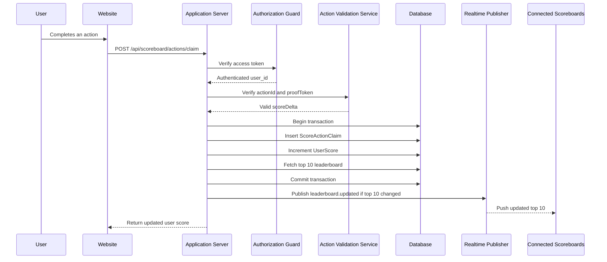

# Scoreboard API Module Specification

## Overview

This module manages score updates and publishes live leaderboard changes for a website scoreboard. The scoreboard displays the top 10 users by score and updates in real time when authorized user actions increase scores.

## Goals

- Allow authorized score increases after a user completes an action.
- Keep a persistent score record per user.
- Return and broadcast the top 10 scores.
- Prevent clients from directly increasing arbitrary scores.
- Provide a clear implementation contract for the backend engineering team.

## Non-Goals

- Defining the user action itself.
- Building the frontend scoreboard UI.
- Supporting score decreases, manual score edits, or admin moderation.
- Supporting multiple scoreboards unless added as a future requirement.

## Main Components

- `Score Update API`: receives action completion requests and updates the user's score.
- `Authorization Guard`: verifies the caller is authenticated and allowed to claim the action.
- `Action Validation Service`: verifies the completed action is legitimate and has not already been claimed.
- `Score Repository`: persists score and action-claim data.
- `Leaderboard Service`: calculates and returns the top 10 scores.
- `Realtime Publisher`: broadcasts leaderboard changes to connected clients.

## Data Model

### UserScore

| Field | Type | Required | Notes |
| --- | --- | --- | --- |
| `user_id` | string | Yes | Unique user identifier. |
| `score` | number | Yes | Current total score. |
| `created_at` | datetime | Yes | Creation timestamp. |
| `updated_at` | datetime | Yes | Last score update timestamp. |

Recommended indexes:

- Unique index on `user_id`
- Descending index on `score`
- Compound index on `score DESC, updated_at ASC` for stable leaderboard ordering

### ScoreActionClaim

| Field | Type | Required | Notes |
| --- | --- | --- | --- |
| `id` | string | Yes | Unique claim id. |
| `user_id` | string | Yes | User receiving the score increase. |
| `action_id` | string | Yes | Unique id for the completed action. |
| `score_delta` | number | Yes | Score amount awarded. |
| `created_at` | datetime | Yes | Claim creation timestamp. |

Recommended indexes:

- Unique compound index on `user_id, action_id`
- Index on `created_at`

The `ScoreActionClaim` table prevents replay attacks where the same action completion is submitted repeatedly.

## API Contract

### Get Leaderboard

```http
GET /api/scoreboard
```

Returns the current top 10 users.

Response:

```json
{
  "data": [
    {
      "rank": 1,
      "userId": "user_123",
      "score": 2400,
      "updatedAt": "2026-06-07T10:00:00.000Z"
    }
  ]
}
```

### Claim Score Update

```http
POST /api/scoreboard/actions/claim
Authorization: Bearer <access_token>
Content-Type: application/json
```

Request:

```json
{
  "actionId": "action_abc123",
  "proofToken": "signed-action-completion-token"
}
```

Response:

```json
{
  "userId": "user_123",
  "score": 2450,
  "scoreDelta": 50,
  "leaderboardChanged": true
}
```

Rules:

- The authenticated user is always derived from the access token, never from request body.
- `actionId` must be unique per user.
- `proofToken` must be verified before awarding score.
- Score updates and action-claim creation must happen in one transaction.
- If the leaderboard changes, publish the new top 10 list to realtime subscribers.

## Authorization and Anti-Abuse Requirements

The backend must not trust a client request that only says "increase my score." The request must prove that an action was completed.

Required controls:

- Authenticate every score update request with a valid access token.
- Derive `user_id` from the authenticated token.
- Verify `proofToken` with the trusted action system or a server-side signing secret.
- Reject expired, malformed, reused, or invalid proof tokens.
- Enforce idempotency with a unique `user_id + action_id` claim record.
- Rate-limit score claim requests per user and per IP.
- Log rejected claim attempts for security review.

Recommended `proofToken` claims:

```json
{
  "sub": "user_123",
  "actionId": "action_abc123",
  "scoreDelta": 50,
  "iat": 1780826400,
  "exp": 1780826700,
  "nonce": "random-id"
}
```

Validation rules:

- `sub` must match the authenticated user.
- `actionId` must match the request body.
- `scoreDelta` must be determined by trusted server rules, not by a client-controlled value.
- `exp` must be short-lived.
- `nonce` or `actionId` must not have been used before.

## Realtime Updates

Use WebSocket or Server-Sent Events.

Recommended endpoint:

```http
GET /api/scoreboard/live
```

Event payload:

```json
{
  "type": "leaderboard.updated",
  "data": [
    {
      "rank": 1,
      "userId": "user_123",
      "score": 2450,
      "updatedAt": "2026-06-07T10:01:00.000Z"
    }
  ]
}
```

Broadcasting rule:

- Only broadcast when the top 10 leaderboard changes.
- Broadcast the full top 10 list instead of partial updates to keep clients simple and consistent.

## Execution Flow



## Error Handling

| Scenario | Status | Response Message |
| --- | --- | --- |
| Missing or invalid token | `401` | `Unauthorized` |
| Token user does not match proof token subject | `403` | `Forbidden` |
| Invalid or expired proof token | `400` | `Invalid action proof` |
| Duplicate action claim | `409` | `Action already claimed` |
| Rate limit exceeded | `429` | `Too many requests` |
| Unexpected server failure | `500` | `Internal server error` |

## Consistency Requirements

- Score update and claim creation must be atomic.
- Duplicate claims must not increase score.
- Leaderboard ordering must be deterministic.
- If two users have the same score, use `updated_at ASC` or another stable tie-breaker.
- Realtime publish should happen after successful commit.

## Suggested Service Interfaces

```typescript
interface ClaimScoreInput {
  userId: string;
  actionId: string;
  proofToken: string;
}

interface ClaimScoreResult {
  userId: string;
  score: number;
  scoreDelta: number;
  leaderboardChanged: boolean;
}

interface ScoreboardService {
  getTopScores(): Promise<LeaderboardEntry[]>;
  claimScore(input: ClaimScoreInput): Promise<ClaimScoreResult>;
}
```

## Additional Improvement Comments

- Consider storing leaderboard snapshots in Redis for faster reads if traffic is high.
- Use a message broker for realtime fan-out if the application runs on multiple instances.
- Add monitoring for suspicious patterns, such as repeated invalid proof tokens or high claim frequency.
- Add audit logs for every successful and failed score claim.
- Keep score rules server-side so clients cannot choose `scoreDelta`.
- Add integration tests for duplicate claims, expired proof tokens, and concurrent score updates.
- Consider using SSE first if clients only need server-to-client updates; WebSocket is useful if bidirectional realtime features are expected later.
